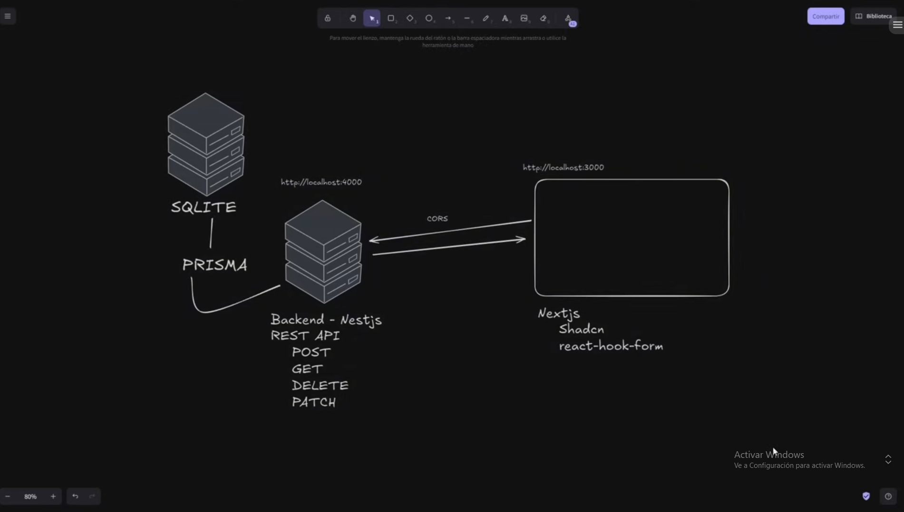
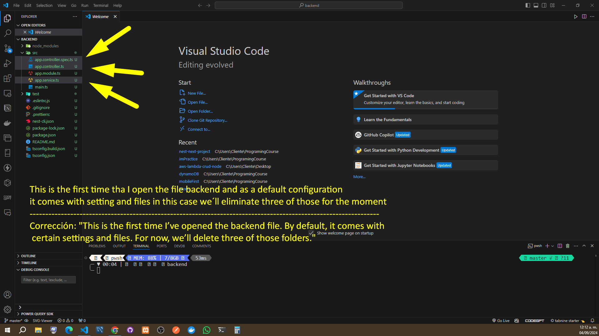
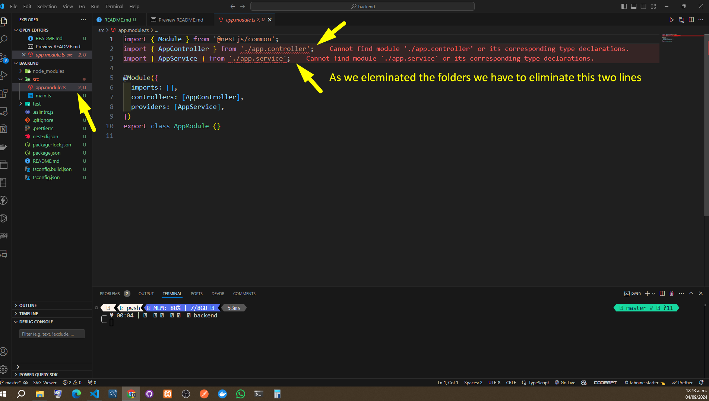
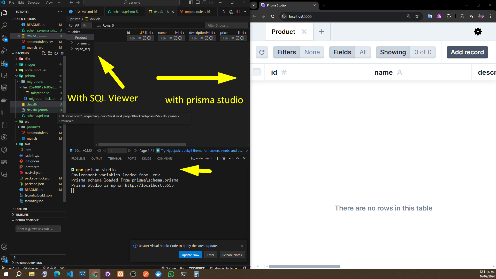
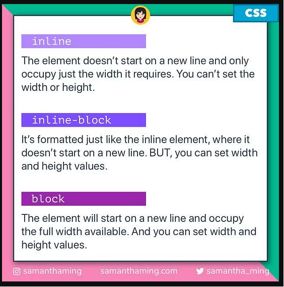
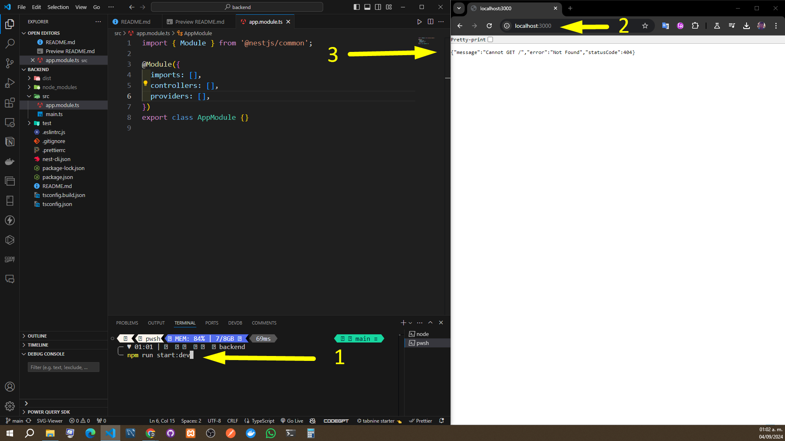
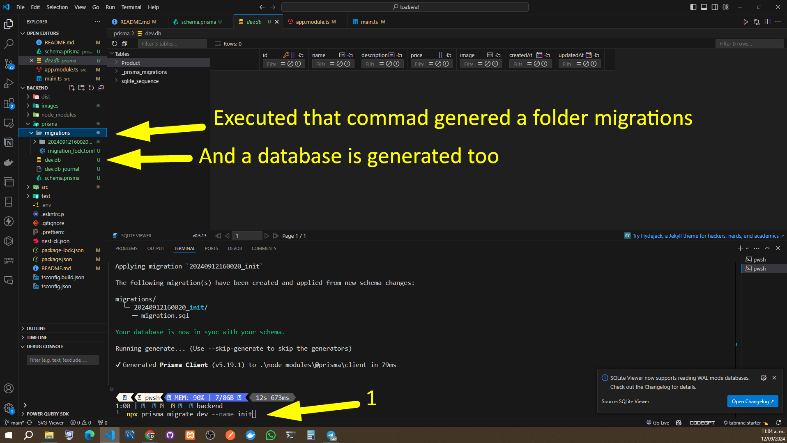
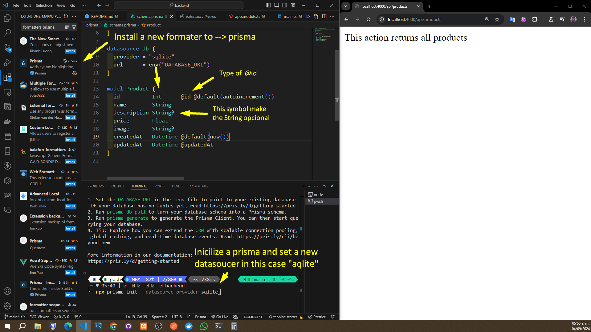
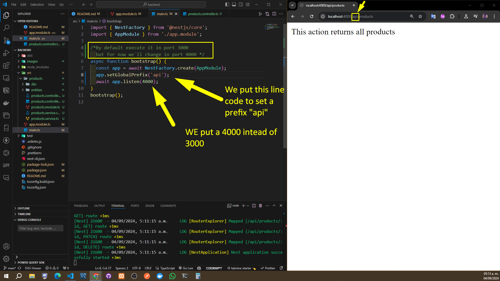

# Nextjs y Nestjs - Aplicación CRUD (con Typescript, Shadcn, prisma y más)

This is a tutorial made at youtube by Fazt

[Nextjs y Nestjs - Aplicación CRUD (con Typescript, Shadcn, prisma y más)](https://www.youtube.com/watch?v=x2vY7gLzeCY&t=10s)

Checamos si tenemos node instalado

```bash
node --version
```

Este comando es para ejecutar un servidor
This command will execute a server

```bash
  npm run start:dev
```

1- We´ll install the prisma module
2- and the second one is to inicialize a set datasource
3- It gonna convert the schema of prisma into a database

```bash
     npm i prisma -D #Install prisma and -D becose is a dependency of development
     npx prisma init --datasource-provider sqlite   #Inicialize the prisma schema
     npx prisma migrate dev --name init #This one create a database
```

To visualize a DB
Another option is  use SQLite Viewer

```bash
     npx prisma studio
```

This command will create all files to do a CRUD
it will create a folder named "product"

```bash
     nest g res products
```

Aparecera este archivo --> src\prisma\prisma.service.ts   --> y es aqui donde pondremos la coneccion

```ts
import { Injectable, OnModuleInit } from '@nestjs/common';
import {PrismaClient} from '@prisma/client'


/*Cada vez que quiera conectarme a un servicio debere llamar esta clase */
@Injectable()
export class PrismaService extends PrismaClient implements OnModuleInit {
    async onModuleInit() {
        await this.$connect();
    }    
}
```

Aqui se encuentra toda la REST API --> src\products\products.controller.ts

Lo siquiente es hacer que funcione con la base de datos
para eso vamos a tener que ir a -->  src\products\products.service.ts

Pero antes le tenemos que decir al archivo --> src\products\dto\create-product.dto.ts

```ts
//export class CreateProductDto {}
import {Product} from '@prisma/client'

/*Para especificar mejor que campos se tienen que omitir */
type CreateProductDto = Omit<Product, 'id' | 'createdAt' | 'updateAt'> 
```

Lo modifimos y quedaria asi  src\products\products.service.ts-->

```ts
import { Injectable } from '@nestjs/common';
import { CreateProductDto } from './dto/create-product.dto';
import { UpdateProductDto } from './dto/update-product.dto';
import { PrismaService } from 'src/prisma/prisma.service';

@Injectable()
export class ProductsService {

  constructor(private prismaService: PrismaService) {

  }
  /*La funcion para crear */
  create(createProductDto: CreateProductDto) {
    this.prismaService.product.create(
      {data: createProductDto}
    )
  }
/*La funcion para listar todos los productos*/
  findAll() {
    return this.prismaService.product.findMany();
  }
```

Lo que se importe en src\products\products.service.ts

Tambien se tiene que importar en --> src\products\products.module.ts
y este caso tenemos que importar prisma service tambien -->

```ts
import { Module } from '@nestjs/common';
import { ProductsService } from './products.service';
import { ProductsController } from './products.controller';
import { PrismaService } from 'src/prisma/prisma.service';

@Module({
  controllers: [ProductsController],
  providers: [ProductsService, PrismaService],   //Aqui importamos --> PrismaService
})
export class ProductsModule {}
```

Una vez que ya agarro podemos provarlo iendo en la app --> THUNDER CLIENT

y hacer una peticion nueva

-Para buscar por un unico producto modificaremos src\products\products.service.ts y le agregaremos ala funcion findOne

```ts
/*Esto trabaja con product.controller.ts */
  findOne(id: number) {
    const productFound = this.prismaService.product.findUnique({
      where: {
        id: id
      }
    })
    if (!productFound){
      throw new NotFoundException('Product with id ${id} not found')
    }
  }
```

## Para usar los iconos de NEST JS

```json
{
    "material-icon-theme.activeIconPack":"nest"
}
```

## Este es un grafico de lo que haremos










